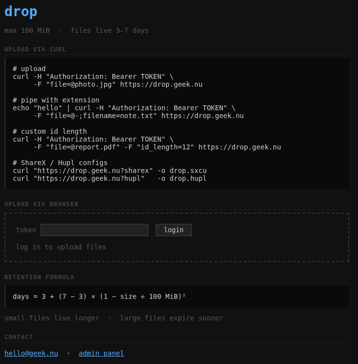
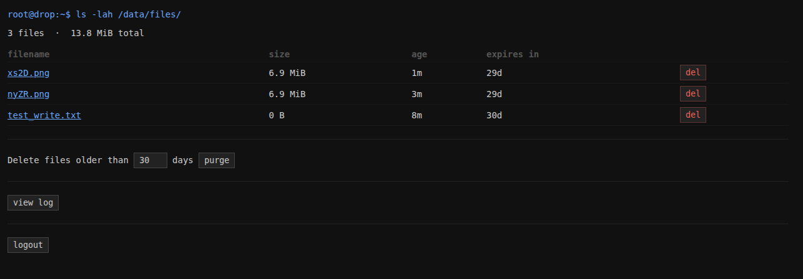

# drop

A self-hosted file drop service. Upload files via `curl` or browser, share a short link. Dark monospace aesthetic, curl-friendly API, upload auth, an admin panel.



- Zero runtime dependencies — single Go binary
- ~12 MB Docker image, ~15 MB RAM at idle
- Token-protected uploads, password-protected admin panel
- EXIF stripping for JPEG, PNG, GIF
- Files expire automatically using a size-based decay formula

---

## Quick start

```bash
git clone <repo>
cd drop
cp .env.example .env
$EDITOR .env          # set UPLOAD_TOKEN and ADMIN_PASSWORD
docker compose up -d --build
```

The service is now reachable on port 80.

---

## Environment variables

Set these in your `.env` file (copied from `.env.example`).

### Upload auth

| Variable | Default | Description |
|---|---|---|
| `UPLOAD_TOKEN` | *(empty)* | Token callers must supply to upload. Leave empty for open uploads. |
| `REQUIRE_AUTH` | `true` if token is set, `false` otherwise | Explicitly enable or disable auth. Set to `false` to allow open uploads even when a token is configured (useful for temporarily disabling auth without removing the token). |

### File limits

| Variable | Default | Description |
|---|---|---|
| `MAX_FILESIZE` | `256` | Maximum upload size in **MiB**. If you raise this above 258, also update `client_max_body_size` in `nginx/default.conf` to match. |

### Retention

| Variable | Default | Description |
|---|---|---|
| `MAX_FILE_AGE` | `30` | Maximum days a file is kept (applies to the smallest files). |
| `MIN_FILE_AGE` | `3` | Minimum days a file is kept (applies to max-size files). |

### Admin

| Variable | Default | Description |
|---|---|---|
| `ADMIN_PASSWORD` | `changeme` | Password for the `/admin` panel. **Change this before exposing publicly.** |
| `ADMIN_EMAIL` | `admin@example.com` | Contact email shown on the index page. |
| `TZ` | `UTC` | Timezone for log timestamps, e.g. `Europe/Amsterdam`. |

**`.env` example:**

```dotenv
UPLOAD_TOKEN=mysecrettoken
REQUIRE_AUTH=true
MAX_FILESIZE=512
MAX_FILE_AGE=14
MIN_FILE_AGE=1
ADMIN_PASSWORD=anothersecretpassword
ADMIN_EMAIL=you@example.com
TZ=Europe/Amsterdam
```

---

## Mapping a folder for uploads

By default the compose file uses a named Docker volume (`drop_data`). This means files are managed by Docker and stored in `/var/lib/docker/volumes/`. If you want files on a specific path on the host — for easy backup, browsing, or mounting on a NAS — replace the named volume with a bind mount.

**Edit `docker-compose.yml`:**

```yaml
services:
  drop:
    volumes:
      # Replace the named volume with a path on your host:
      - /your/host/path:/data

# Remove or comment out the volumes section at the bottom:
# volumes:
#   drop_data:
```

The container writes two things inside `/data`:

| Path inside container | Contents |
|---|---|
| `/data/files/` | Uploaded files |
| `/data/uploads.log` | Upload log (timestamp, IP, size, original name, stored name) |

**Full bind-mount example:**

```yaml
services:
  nginx:
    image: nginx:alpine
    restart: unless-stopped
    ports:
      - "80:80"
    volumes:
      - ./nginx/default.conf:/etc/nginx/conf.d/default.conf:ro
    depends_on:
      - drop

  drop:
    build: .
    restart: unless-stopped
    environment:
      UPLOAD_TOKEN:   ${UPLOAD_TOKEN:-}
      REQUIRE_AUTH:   ${REQUIRE_AUTH:-true}
      MAX_FILESIZE:   ${MAX_FILESIZE:-256}
      MAX_FILE_AGE:   ${MAX_FILE_AGE:-30}
      MIN_FILE_AGE:   ${MIN_FILE_AGE:-3}
      ADMIN_PASSWORD: ${ADMIN_PASSWORD:-changeme}
      ADMIN_EMAIL:    ${ADMIN_EMAIL:-admin@example.com}
      TZ:             ${TZ:-UTC}
    volumes:
      - /srv/drop:/data   # <-- your host path here
```

> The container runs as a non-root user (`drop`). Make sure the host directory is owned or writable by UID/GID **65534** (the Alpine `nobody`/`drop` user), or relax permissions with `chmod 777 /srv/drop`.
>
> ```bash
> mkdir -p /srv/drop/files
> chown -R 65534:65534 /srv/drop
> ```

---

## Uploading files

### curl (plain text response)

```bash
# Open instance
curl -F "file=@photo.jpg" http://localhost

# With upload token
curl -H "Authorization: Bearer mysecrettoken" \
     -F "file=@photo.jpg" http://localhost

# Pipe content (set filename to get extension right)
echo "hello world" | curl -F "file=@-;filename=note.txt" http://localhost

# Custom ID length (4–24 chars, default 4)
curl -F "file=@report.pdf" -F "id_length=10" http://localhost
```

The response is a plain URL, e.g. `http://localhost/f/aBc1.jpg`.

### Browser

Visit `http://localhost` — there's an upload form and paste-to-upload (paste an image with Ctrl+V / Cmd+V).

### ShareX / Hupl

Download pre-filled config files from the service. When auth is enabled these endpoints require an admin session, so you must log in first and pass the session cookie manually (the cookie's `Path: /admin` means a cookie jar won't include it for `/?sharex`):

```bash
# 1. Log in and capture the session token
SESSION=$(curl -si -X POST http://localhost/admin \
  -d "password=YOUR_ADMIN_PASSWORD" \
  | grep -i 'set-cookie:' \
  | grep -o 'drop_session=[^;]*' \
  | cut -d= -f2)

# 2. Download the config files
curl -b "drop_session=$SESSION" "http://localhost?sharex" -o drop.sxcu
curl -b "drop_session=$SESSION" "http://localhost?hupl"   -o drop.hupl
```

If auth is disabled (`REQUIRE_AUTH=false` / no `UPLOAD_TOKEN` set), the plain unauthenticated form works:

```bash
curl "http://localhost?sharex" -o drop.sxcu
curl "http://localhost?hupl"   -o drop.hupl
```

The downloaded configs already contain the upload token (baked in by the server), so you can import them directly into ShareX or Hupl without further configuration.

---

## Admin panel



Visit `http://localhost/admin` and log in with `ADMIN_PASSWORD`.

Features:
- File list with size, age, and time until expiry
- Delete individual files
- Bulk purge: delete all files older than N days
- View the last 200 lines of the upload log
- Logout

---

## File retention

Files are not kept forever. Retention is based on file size:

```
days = MIN_FILE_AGE + (MAX_FILE_AGE − MIN_FILE_AGE) × (1 − size ÷ MAX_FILESIZE MiB)²
```

With the defaults (`MIN_FILE_AGE=3`, `MAX_FILE_AGE=30`, `MAX_FILESIZE=256`):

| File size | Retained for |
|---|---|
| 1 KB | ~30 days |
| 25 MiB | ~24 days |
| 100 MiB | ~12 days |
| 256 MiB | 3 days |

Expired files are purged automatically every 12 hours via the Docker healthcheck. You can also trigger a purge manually:

```bash
docker compose exec drop /app/drop purge
```

---

## Allowed file types

| Category | Extensions |
|---|---|
| Images | `jpg`, `jpeg`, `png`, `gif`, `webp`, `avif`, `heic` |
| Documents | `pdf` |
| Text | `txt`, `md`, `csv`, `log`, `json` |

SVG, HTML, and XML are intentionally excluded (XSS risk).

JPEG, PNG, and GIF uploads are re-encoded to strip EXIF metadata before storage.

---

## TLS / reverse proxy

The service listens on HTTP only. Put it behind a TLS-terminating reverse proxy (Caddy, Traefik, nginx with Let's Encrypt). The app reads `X-Forwarded-Proto` to construct correct `https://` URLs in responses.

If you already have a proxy in front of the nginx container and want to skip nginx entirely, you can expose the `drop` service directly:

```yaml
  drop:
    ports:
      - "8080:8080"
```

---

## Resource usage

| Metric | Value |
|---|---|
| Docker image size | ~12 MB |
| RAM at idle | ~15 MB |
| External Go dependencies | none |
| Processes in container | 1 (the binary) |
